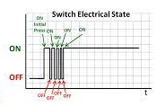
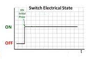
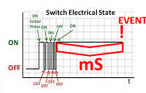

 

# GPIO Handling and "NODE-PINK" Introduction

# Contents

* [Introduction](#introduction)
* [Graphical Example: debouncing](#an-example---debouncing-graphically)
* [Code Example: debouncing](#an-example---debouncing-in-code)
* [Essential further reading](#essential-further-reading)
* [Relevant Youtube channel videos](https://www.youtube.com/channel/UCYi-Ko76_3p9hBUtleZRY6g)
  * [3: GPIO simple start RAW input](https://www.youtube.com/watch?v=k-TgHK5qTWc)
  * [4: GPIO Filtering & Debouncing](https://www.youtube.com/watch?v=GflSWkZcr9g)
  * [5: GPIO NODE-PINK and Debouncing descendants](https://www.youtube.com/watch?v=VUAuQOKkLLY)
  * [6: GPIO The other children of debouncing: it's about time](https://www.youtube.com/watch?v=n6Y5OM-w2Kc)
  * [7: GPIO Stragglers and DIY plumbing](https://www.youtube.com/watch?v=SSMLsgJKotA)
  * [8: GPIO Rotary encoders need not be an Enigma](https://www.youtube.com/watch?v=4ySOh0ukyrc)
  * [9: GPIO Analog Inputs](https://www.youtube.com/watch?v=1oxsNVHloqA)
  * [10: Advanced Plumbing](https://youtu.be/yyyAttshSV0)

---

# Introduction

NODE-PINK is a playful analogy with the well-know IOT tool [NODE-RED](https://nodered.org/). If you are not already familiar with [NODE-RED](https://nodered.org/), you should be: it's a fantatsic tool for makers and IOT fans.

All you need to know is that it operates on the concept of "nodes" which are then "wired" together into "flows" to achieve a task, for example:


H4Plugins' [H4P_PinMachine](pm.md) plugin manages all GPIO input / output using a similar principle, but on tiny scale and much diluted, hence the "pink". It treats a GPIO pin as a "stream of bits" which - over time - can become a "message" that gets passed from one node to another to another - in a "flow" - until the required result is achieved.

In NODE-PINK, the node usually operates as a "filter" which can either pass the message on - allowing the flow to continue - or it can halt the flow because the job is now done.

In 99% of cases, "job done" is to send an `H4PE_GPIO` event (see [Everything is an event: Listeners, Emitters and Handlers](events.md)) with `svc` set to the GPIO pin number and `msg` set to the current value of the pin.

Be aware that the "value" is not always a simple binary 1 or 0. As the flows get more complex (and useful) they can pass *any* 32-bit value, even including negative numbers. For example,a simple `h4pEncoder` (see [GPIO/NODE-PINK: rotary encoder flows](encoders.md)) passes -1 when turned 1 click anti-clockwise and an `h4pTimed` (see [GPIO/NODE-PINK: basic flows](basic.md)) passes the number of milliseconds it was held down...but we are jumping ahead!

## An example - debouncing, graphically

Perhaps the easiest way to explain the NODE-PINK methodology is to look at switch debouncing. If you don't know what that is, then you *absolutely* need to. Here's an :door: [excellent article](http://www.ganssle.com/debouncing.htm) explaining it all and how to deal with it. Many devices you might want to hook up are bouncy, noisy, or complicated. Some e.g. rotary encoders are usually all three at once...

The TL;DR version is that when you press e.g. a "tact button" it very rarely sends the pin 1 then 0 (or 0 then 1 if its "active low"). It more likely something like: 1...0..1.0.....1..0101010 where the dots represent "significant" time gaps, often of the order of milliseconds. If you plotted a graph it might look like this:



And *not* a simple clean 01 transition as many beginners might expect. All the extra 1s and 0s are called "bounce" and we must ignore them or our lights will flicker horribly and possibly explode. So we need some kind of "black box" that will take that nasty bouncy stream of 1s and 0s as input , but spit out something like this:



Putting it all together what we want is:


Which then allow us simply to react to the value of the H4PE_GPIO `msg` knowing it can only happen *once* per transition - *as long as we choose the correct value of milliseconds* for the particular switch we have attached to the GPIO pin, which can take some trial-end-error.

In the code, NODE-PINK calls the flow a "pipeline" and the pipeline for `hp4Debounced` looks like:

```cpp
npSMOOTH{ms} -> npPUBLISHVALUE; // ms = milliseconds debounce time
```

The debounce value `ms` is the number of milliseconds for which the new state must stay constant before the node emits a change event. Visually it is represented by:



TL;DR again, 12-15 milliseconds is a typical value, but you need to try a few values for each switch you use and make the number as small as you possibly can without seeing any bounce.

## An example - debouncing, in code

Now that you understand "the NODE-PINK way", the following code should make a lot of sense:

```cpp
#include<H4Plugins.h>
H4_USE_PLUGINS(115200,H4_Q_CAPACITY,false) 

H4P_EventListener gpio(H4PE_GPIO,[](const string& pin,H4PE_TYPE t,const string& msg){
    int p=atoi(pin.c_str());
    switch(p){
      case 0:
        Serial.printf("P=%d V=%s\n",p,msg.c_str()); // only gets called 1x per transtion 1->0 or 0->1
        break;
    }
});

h4pDebounced db(0,INPUT_PULLUP,ACTIVE_LOW,15); // GPIO 0, "on" when low (0v), 15mS of debounce
```

---

# Essential further reading:

* [GPIO/NODE-PINK: a logical approach](logphys.md)
* [GPIO/NODE-PINK: basic flows](basic.md)
* [GPIO/NODE-PINK: rotary encoder flows](encoders.md)
* :building_construction: [GPIO/NODE-PINK: analog flows](analog.md)
* :building_construction: [GPIO/NODE-PINK: advanced techniques](nodepinkadv.md)

---

(c) 2021 Phil Bowles h4plugins@gmail.com

* [Youtube channel (instructional videos)](https://www.youtube.com/channel/UCYi-Ko76_3p9hBUtleZRY6g)
* [Facebook H4  Support / Discussion](https://www.facebook.com/groups/444344099599131/)
* [Facebook General ESP8266 / ESP32](https://www.facebook.com/groups/2125820374390340/)
* [Facebook ESP8266 Programming Questions](https://www.facebook.com/groups/esp8266questions/)
* [Facebook ESP Developers (moderator)](https://www.facebook.com/groups/ESP8266/)
* [Support me on Patreon](https://patreon.c